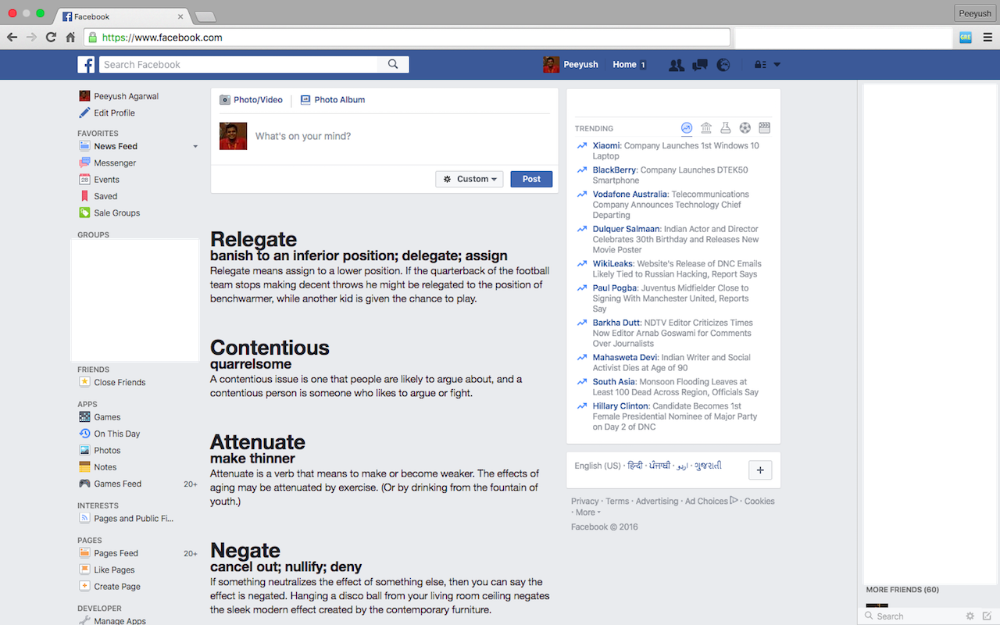

# GRE Words

A chrome extension that removes distracting posts from Facebook news feed and replaces it with something interesting! Right now, you can completely eliminate the feed or replace it with GRE words along with their meanings.

## Installation Instructions

The extention can be installed from [Chrome web store](https://chrome.google.com/webstore/detail/gre-fb-news-feed/hbhdccjdfjcpakliojfnpincocolhcob).

If you would like to modify the extention (maybe change the number or words shown/modify the word list), you can clone the repo and make changes in `kill.js`. You can then load it directly by enabling Developer mode in `chrome://extensions/` and loading the unpacked extention directly from file system. 

## Screenshots

  

## TODO
- Port the extension to firefox.

## Licence
The project is released under the [MIT License](http://opensource.org/licenses/MIT).

## Attribution
The project is built on top of nealwu's [KillNewsFeed](https://github.com/nealwu/KillNewsFeed).
